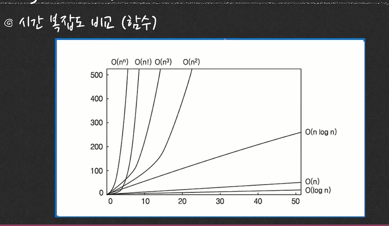

## 2. 성능 분석(Performance Analysis)

### 2-1. 성능과 점근적 분석법


#### 성능과 점근적 분석법

- 성능(performance / efficiency) = 결과(solution) / 비용=자원(resource)
- 점근적 분석법: 성능을 근사적으로 표현하는 방법


##### 자원의 두 가지 측면

- 공간 / 시간

  - 공간에 관련된 성능: 공간 복잡도 (space-complexity), 특정한 프로그램을 수행하는데 필요한 **메모리**
  - 시간에 관련된 성능 : 시간 복잡도 (time-complexity), 특정한 프로그램을 수행하는데 요구되는 시간(**CPU**)

  ==> 메모리보다 CPU가 비싼 자원이기 때문에 시간이 공간보다 중요시 됨


##### 공간 복잡도 및 시간 복잡도의 예

- N개의 정수를 입력 받아서 합을 구하는 프로그램을 짠다면?

  1. 정수를 하나씩 읽어서 합을 구하는 방법

     ```c
     int i, x, sum;
     for (i = 0; sum = 0; i < N; i++) {
         cin >> x;
         sum += x;
     }
     cout << sum;
     ```

     - 공간복잡도: O(1) `N의 크기에 관계 없이 변수 3개의 공간이 일정하기 때문`
     - 시간복잡도: O(N) `N의 크기에 비례하여 시간이 걸림`

  2. 정수를 하나씩 읽어서 저장한 후에 합을 구하는 방법

     ```c
     int i, *x, sum;
     x = new int[N];
     for (i = 0; i < N; i++) {
         cin >> x[i];
     }
     for (i = 0; sum = 0; i < N; i++) {
         sum += x[i];
     }
     cout << sum;
     ```

     - 공간복잡도: O(N) `N의 크기에 비례하여 기억공간이 늘어남`
     - 시간복잡도: O(N) `N의 크기에 비례하여 시간이 걸림`

     

##### 점근적 분석법

- 시간 복잡도는 매우 큰 입력(reasonably large length of input) 에 대해서 측정함
- g(n) 을 이용한 f(n) 의 성능 표현
  - g(n)은 f(n) 보다 성능이 나쁨 `g(n) is the worst case of f(n)`
  - 최악의 경우에도 f(n)은 g(n) 보다 좋음 `In the worst case, f(n) is better than g(n)`
  - f(n)의 상한은 g(n)임 `The upper bound of f(n) is g(n)`
  - f(n) <= g(n)
  - g(n) 은 많이 사용되는 표준적인 함수를 이용 `예) 1, n, log n, n^2, n log n, n^n`


### 2-2 Big-O 표기법

#### Big-O 표기법의 예

1) g(n) = 1

- 상수 시간 복잡도 (constant time complex)

- f(n) = O(1)

- 입력이 증가해도 항상 일정한 시간이 걸리는 경우

- 가장 이상적인 성능

  ```c++
  void f(int n)
  {
      printf("Hello");
  }
  
  void f2(int n)
  {
      printf("Hello");
      printf("World");
  }
  ```

  

2) g(n) = n

- 선형 시간 복잡도(linear time complex)

- f(n) = O(n)

- 시간은 입력의 크기에 비례해서 증가함(n에 비례)

  ```c++
  void func(int n)
  {
      i = 0;
      while (i < n) {
          prinf("Hello");
          i++;
      }
  }
  ```


3) g(n) = n^k

- 다항 시간 복잡도(polynominal time complex)

- f(n) = O(n^2) if k = 2

- 시간은 입력의 크기의 k제곱에 비례해서 증가함

  ```c++
  void func(int n)
  {
      for (i=0; i < n; i++) {
          for (j=0; j < n; j++) {
              printf("Helle");
          }
      }
  }
  ```

  

4) g(n) = k^n

- 지수 시간 복잡도(exponential time complex)

- f(n) = O(2^k) if k = 2

  ```c++
  int fibo(int n) {
      if (n == 0)
          return 0;
      if (n == 1) 
          return 1;
      return func(n - 1) + func(n - 2);
  }
  ```

  

5) g(n) = logk n

- 로그 시간 복잡도(log time complex)

- f(n) = O(log n) if k =2 

- 시간은 n의 log에 비례해서 증가함

- 밑(k) 는 상관없음

  ```C++
  int func (int n)
  {
      for (k = 1; k < n; k = k * 10) {
          printf("Hello");
      }
  }
  ```

  

6) g(n) = n log n

- f(n) = O(n log n) if k =2

  ```C++
  void func (int n) 
  {
      for (i = 1; i <= n; i++) {
          for (j = 1; i <= n; j *= 10) {
              printf("Hello");
          }
      }
  }
  ```

  

