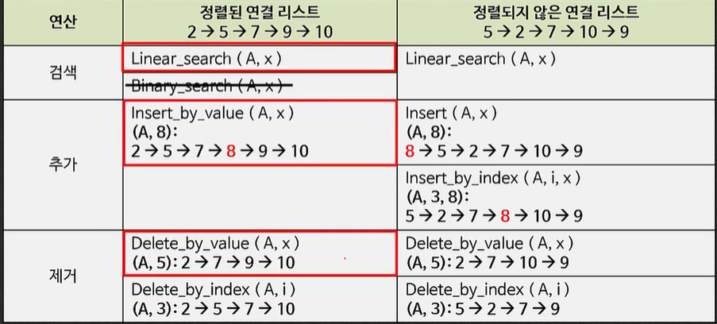
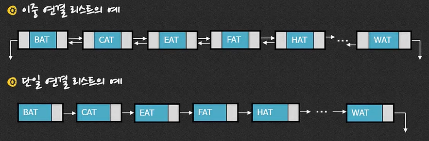

# Linked List

### 4-1. 연결 리스트

- 리스트의 정의 복습
  - 리스트란: 유한한 원소들의 나열(a finite sequence of elements)
  - 각 원소들은 인덱스에 대응됨(index => element)
  - 2가지 형태의 구현이 존재
    - 인덱스 기반 구현 -> 배열(Array)
    - 포인터 기반 구현 -> 연결 리스트(Linked List)


##### 배열과 연결리스트의 비교

- 배열: 원소들이 메모리에서 일정한 간격(a fixed distance)으로 나열되어 있음

- 연결 리스트: 원소들이 메모리에서 임의의 위치(at arbitrary position)에 배치되어 있음, 한 원소는 다음 원소를 가리키는 link 를 가지고 있음

| a0   | a1   | a2   | a3   | a4   | a5   | a6   |
| ---- | ---- | ---- | ---- | ---- | ---- | ---- |
| BAT  | CAT  | EAT  | FAT  | HAT  | JAT  | LAT  |


|            | 배열                                                    | 연결리스트                                                 |
| ---------- | ------------------------------------------------------- | ---------------------------------------------------------- |
| 메모리공간 | 연속된 메모리 주소                                      | 이산된 메모리 주소                                         |
| 공간 할당  | 정적 할당/동적 할당                                     | 동적 할당                                                  |
| 접근 경로  | 첫 번째 원소의 주소                                     | 첫 번째 원소의 주소                                        |
| 접근 방법  | 인덱스                                                  | 포인터                                                     |
| 접근 방식  | Random access (원소의 위치와 접근 시간의 연관성이 없음) | Sequential access(접근 시간이 원소의 위치에 의해서 결정됨) |


##### 연결 리스트

- node = data + link

- node는 메모리의 임의의 위치에 배치된다

- 각 node는 다음 node를 가리키는 link를 포함하고 있음

- 구조체와 클래스를 이용한 정의

  - C언어 => Struct + typedef

    ```C
    typedef struct_node node;
    struct_node {
        char ats[3];
        node *link;
    }
    
    ```

  - C++ => Class

    ```c++
    class node {
        char ats[3];
        node *link;
    }
    ```


##### 단일 연결 리스트(Singly Linked List)

- 각 node는 하나의 link 를 가짐(next 또는 rlink)
- chain이라고도 정의함

##### 이중 연결 리스트(Doubly Linked List)

- 각 node는 두 개의 link를 가짐(`next` 또는 `rlink`, `prev` 또는 `llink`)


### 4-2. 단일 연결 리스트

- 단일 연결 리스트의 노드 정의(with head node)

  ```c++
  class node{
      data_type item;
      node *link;
  };
  
  class hnode {
      node *link;
  };
  ```

- 단일 연결 리스트의 연산

  - 생성(Create)

  - 검색(Search)

  - 추가(Insert)

  - 제거(Delete)

  - 갱신(Modify)

  - 길이(Length)

  - 다음(Next)

  - 이전(Previous)

    ....




- 생성(create)

  - 원소가 없는 연결 리스트를 생성

    ```C++
    void main()
    {
        hnode first;
    }
    ```

- 검색(search)

  - 찾는 원소(key element)를 저장하고 있는 노드의 포인터를 리턴

  - 선형 탐색만 가능

    ```c++
    void main()
    {
        node *temp = first.search("HAT");
    }
    ```


##### 검색 연산의 수행 과정

1. hnode에서 검색을 시작함

   ```c++
   node *hnode::search( data_type key )
   {
       return this->link->search( key )
   }
   ```

2. node 에서의 검색

   ```c++
   node *node::search( data_type key )
   {
       // 1. 검색하는 값을 가진 노드를 찾음
       node *curr = this;
       while (curr != NULL) {
           if (curr->item == key)
               return curr; // Found
           curr = curr->link;
       }
       return NULL; // Not Found
   }
   ```

- 배열에서의 선형 검색과 비교

  ```c++
  node *curr = this;
  while (curr != NULL) {
      if ( curr->item == key )
          return curr; // Found
      curr = curr->link;
  }
  
  for ( node *curr = this; curr != NULL; curr=curr->next )
      if ( curr->item == key )
          return curr;
  
  for ( int i=0; i < n; i = i + 1 )
      if ( list[i] == key )
          return list[i];
  ```

- 시간복잡도 : O(n)


##### 추가 연산의 수행 과정

- 추가할 데이터를 저장하는 새로운 노드를 연결 리스트에 삽입하는 연산

  ```c++
  void main()
  {
      first.insert("GAT");
  }
  ```

1. 데이터를 추가할 적절한 위치를 결정

2. 데이터를 저장할 새로운 노드를 생성

3. 새로운 노드가 연결리스트에 포함 되도록 링크를 갱신

   ```c++
   void node::insert ( data_type key )
   {
       // 1. 적절한 위치를 결정
       node *curr = this;
       while ( curr->link != NULL ) {
           if ( curr->link->item > key ) // 추가하고자 하는 원소보다 큰 원소를 다음 원소로 저장하고 있는 원소에서 멈춰야 한다!
               break;
           curr = curr->link;
       }
       // 2. 새로운 노드를 생성
       node *nnode = new node;
       nnode->item = key;
       
       // 3. 링크를 갱신
       nnode->link = curr->link;
       curr->link = nnode;
   }
   ```

   - 예외적인 경우는(extraordinary case: degenerate case)?
     - 첫 번째 노드 앞에 추가하는 경우
     - 텅 빈 리스트에 처음으로 추가하는 경우
     - 마지막 노드 뒤에 추가하는 경우
     - etc...

- 시간 복잡도: O(n) => 추가하고자 하는 위치를 찾는 시간


##### 제거 연산의 수행 과정

- 리스트로부터 원하는 원소의 연결을 해제하여 리스트에서 그 원소를 삭제하는 연산

  ```c++
  void main()
  {
      first.delete("FAT");
  }
  ```

1. 제거할 원소를 찾음

2. 링크를 갱신해서 제거할 원소를 리스트에서 분리

3. 제거된 노드의 메모리를 free함

   ```c++
   void hnode::delete ( data_type key )
   {
       this->link->delete ( key );
   }
   
   void node::delete ( data_type key )
   {
       // 1. 제거할 원소를 찾음
       node *curr = this;
       while ( curr->link != NULL ) {
           if ( curr->link->item )
               break;
           curr = curr->link;
       }
       // 2. 링크를 갱신
       node *dnode = curr->link;
       curr->link = dnode->link;
       
       // 3. 제거된 node를 memory에서 free
       free ( dnode );
   }
   ```

   - 예외 케이스
     - 첫 번째 노드를 제거하는 경우
     - 텅 빈 리스트에서 제거하는 경우
     - 마지막 노드를 제거하는 경우
     - etc....

- 시간 복잡도: O(n)


### 4-3. 이중 연결 리스트

- 이중 연결 리스트란?

  각 node 가 다음(next, rlink) node를 가리키는 link와 이전(prev, llink) node를 가리키는 link를 동시에 가지고 있는 연결 리스트




- 이중 연결 리스트의 노드 정의

  ```c++
  class node {
      data_type item;
      node *llink, *rlink;
  };
  
  // 첫 번째 원소를 가리키는 head node
  class hnode {
      node *link;
  };
  ```

- 이중 연결 리스트의 연산
  - 생성(create)
  - 검색(search)
  - 추가(insert)
  - 제거(delete)
  - 갱신(modify)
  - 길이(length)
  - 다음(next)
  - 이전(previous)
  - etc...


##### 이중 연결 리스트에서의 추가 연산

- 추가할 데이터를 저장하는 새로운 노드를 연결 리스트에 삽입하는 연산

  ```c++
  void main()
  {
      first.insert ( "GAT" );
  }
  ```

  1. 데이터를 추가할 적절한 위치를 결정

  2. 데이터를 저장할 새로운 노드를 생성

  3. 새로운 노드가 연결 리스트에 포함되도록 링크를 갱신

  ```c++
  void node::insert ( data_tyep key )
  {
      // 1. 적절한 위치를 결정
      node *curr = this;
      while ( curr->rlink != NULL ) {
          if ( curr->rlink->item > key )
              break;
          curr = curr->rlink;
      }
      // 2. 새로운 노드를 생성
      node *nnode = new node;
      nnode->item = item;
      
      //3. 링크를 갱신
      // 3-1. rlink 방향
      nnode->rlink = curr->rlink;
      curr->rlink = nnode;
      // 3-2. llink 방향
      nnode->llink = curr;
      nnode->rlink->llink = nnode;
  }
  ```

  - 예외 케이스
    - 첫 번째 노드 앞에 추가하는 경우
    - 텅 빈 리스트에 처음으로 추가하는 경우
    - 마지막 노드 뒤에 추가하는 경우
    - etc..
  - 시간 복잡도: O(n)


##### 이중 연결 리스트에서 제거 연산

- 리스트로부터 원하는 원소의 연결을 해제하여 리스트에서 그 원소를 삭제하는 연산

  ```c++
  void main()
  {
      first.delete( "FAT" );
  }
  ```

  1.  제거할 원소를 찾음
  2. 링크를 갱신해서 제거할 원소를 리스트에서 분리
  3. 제거된 노드의 메모리를 free함

  ```c++
  void node::delte ( data_type key )
  {
      // 1. 제거할 원소를 찾음
      node *curr = first;
      while ( curr->rlink != NULL ) {
          if ( curr->rlink->item == key )
              break;
          curr = curr->rlink;
      }
      
      // 2. 링크를 갱신
      node *dnode = curr->rlink;
      curr->rlink = dnode->rlink; 	
      curr->rlink->llink = dnode->llink;
      
      // 3. 제거된 node를 free
      free ( dnode );
  }
  ```

  - 예외 케이스
    - 첫 번째 노드를 제거하는 경우
    - 텅 빈 리스트에서 제거하는 경우
    - 마지막 노드를 제거하는 경우
    - etc...
  - 시간 복잡도: O(n)

  

#### 단일 연결 리스트와 이중 연결 리스트의 연산 시간복잡도 비교

| 연산          | 단일 연결 리스트 | 이중 연결 리스트 |
| ------------- | ---------------- | ---------------- |
| 검색 (search) | O(n)             | O(n)             |
| 추가(insert)  | O(n)             | O(n)             |
| 제거(delete)  | O(n)             | O(n)             |


##### 검색 연산의 비교

| 자료구조                | 검색연산            |                                                              |
| ----------------------- | ------------------- | ------------------------------------------------------------ |
| 배열                    | 선형 검색           | for (int i; i<n; i++)<br />    if (arr[i] == x)<br />        return i; |
| 배열                    | 이진 검색           | int mid = (s + e) / 2;<br />    if (x == arr[mid])    return mid;<br />    else if (x < arr[mid])    return bs (arr, s, mid-1, x);<br />    else    return bs(arr, mid+1, e, x); |
| 연결 리스트(단일, 이중) | 선형 검색(while문)  | node *curr = this;<br />while ( curr != NULL ) {<br />    if ( curr->item == item)<br />        return curr;<br />    curr = curr->link;<br />} |
| 연결 리스트(단일, 이중) | 선형 검색(for loop) | for (node *curr = this; curr != NULL; curr = curr->link)<br />    if ( curr->item == item)<br />        return curr; |


##### 추가 연산의 비교

| 리스트           | 추가                                                         |
| ---------------- | ------------------------------------------------------------ |
| 배열             | for (i=0; i<n; i+++)<br />    if ( arr[i] > x)    break;<br />for (j=n-1; j>=i; j--)<br />    arr[j+1] = arr[j];<br />arr[i] = x;<br />n++; |
| 단일 연결 리스트 | for (node *=this; curr->link != NULL; curr=curr->link)<br />    if ( curr->link->item > item)    break;<br />node *nnode = new node;<br />nnode->item = item;<br />nnode->link = curr->link;<br />curr->link = nnode; |


##### 제거 연산의 비교

| 리스트           | 제거                                                         |
| ---------------- | ------------------------------------------------------------ |
| 배열             | for ( int i=0; i < n; i++ )<br />    if ( arr[i] == x )    break;<br />if ( i==n )    return;<br />for ( int j =i; j < n-1; j++ )<br />    arr[j] = arr[j+1];<br />n--; |
| 단일 연결 리스트 | for ( node *curr = this; curr->link != NULL; curr = curr->link )<br />    if ( curr->link->item == item)    break;<br />node * dnode = curr->link;<br />curr->link = dnode->link;<br />free( dnode ); |

