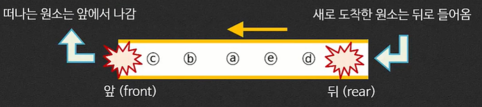
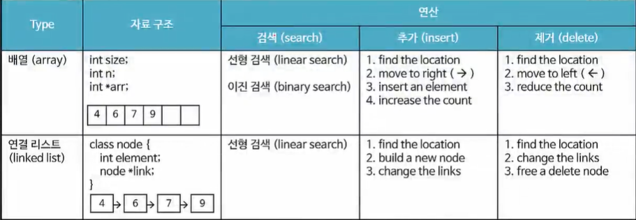
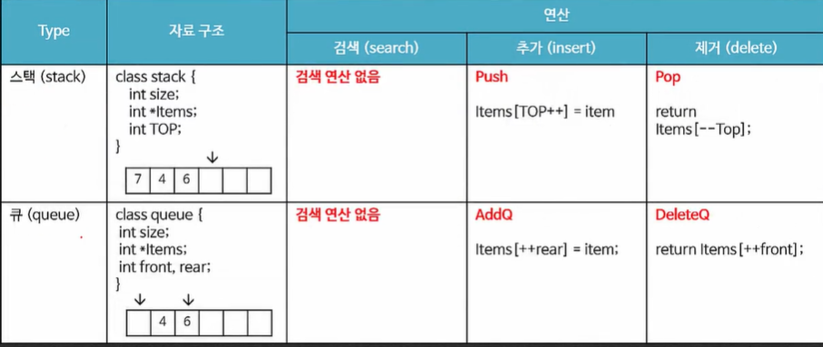
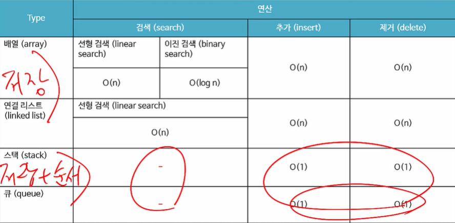
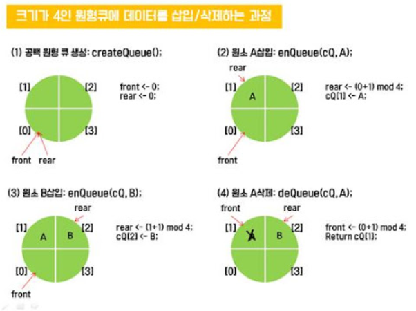
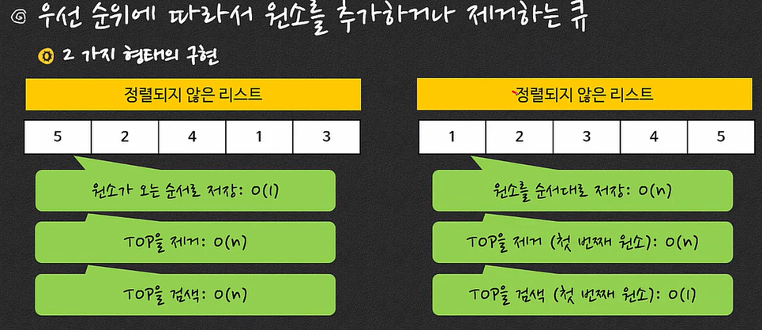

# 5. 스택/큐(Stack/Queue)

### 5-1. 스택과 연산

- 스택(Stack) 의 개념 

  - 원소를 도착한 시간의 반대 순서로 저장한 리스트

  - 원소의 추가와 제거가 탑(top) 이라고 불리우는 한 끝에서만 일어나는 리스트

    (A list in which insertions and deletions are made at one end called the top)

  - Last-In First-Out (LIFO 또는 FILO)

- 스택에 원소를 추가하는 연산: Push
- 스택에서 원소를 제거하는 연산: Pop


#### 스택의 자료구조

- Size: 스택에 저장할 수 있는 원소의 수

- List of elements: 원소를 저장하는 리스트

- TOP: top의 위치를 나타내는 값

  ```c++
  class Stack {
      int Size;
      DataType *Items;
      int TOP;
  }
  ```

- 스택의 연산

  - 생성(create Stack) : 지정된 크기의 원소를 저장하는 스택을 할당

    - maxStackSize 개의 원소를 저장하는 공간을 할당

    - TOP을 0으로 초기화

      ```C++
      void Stack::CreateStack ( int maxStackSize )
      {
          Size = maxStackSize;
          tItem = new Datatype[Size];
          TOP = 0; // -1로 초기화 할 수도 있음
      }
      
      void main () {
          Stack myStack.CreateStack(4);
      }
      ```

      

  - 엠티(IsEmpty) : 스택에 원소가 없으면 True를 리턴

    - 스택이 비어있으면(empty), True를 리턴

    - 스택이 비어있음 -> TOP == 0

      ```c++
      int stack::is_Empty() {
          return ( TOP == 0 );
      }
      ```

      

  - 풀(IsFull) : 스택에 더 원소를 넣을 수 없으면 True 를 리턴

    - 스택에 더 이상 원소를 추가할 수 없으면 True를 리턴

    - 더 이상 원소를 추가할 수 없음 -> TOP == maxStackSize

      ```c++
      int Stack::is_Full() {
          return ( TOP == maxStackSize );
      }
      ```

      

  - 추가(Push) : 스택에 새로운 원소를 삽입

    - 스택에 새로운 원소를 삽입하는 연산

    - Push는 오직 TOP에서만 수행됨

    - 추가 후에는 TOP을 증가시킬 것

      ```c++
      void Stack::push( DataType DataItem ) {
          Items[TOP] = DataItem;
          TOP++;
      }
      
      void main() {
          myStack.push("Potato");
      }
      ```

    - 예외적인 경우? Overflow, Full인 스택에 원소를 추가하는 경우

      ```c++
      void Stack::push( DataType DataItem ) {
          if ( isFull() )
              printf("Pushing in Full Stack\n");
          Items[TOP] = DataItem;
          TOP++;
      }
      ```

      

  - 제거(Pop) : 스택에서 원소를 삭제

    - 스택에서 원소 하나를 삭제하고 리턴하는 연산

    - Pop은 TOP에서 가장 가까운 원소를 제거함

    - 제거한 다음 반드시 TOP을 1 감소시킬 것

      ```c++
      Datatype Stack::pop() {
          TOP--;
          return Items[TOP];
      }
      
      main() {
          Data = Stack.pop();
      }
      ```

    - 예외적인 경우? Underflow, Empty인 스택에서 원소를 제거하는 경우

      ```c++
      Datatype Stack::pop() {
          if ( is_Empty() )
              printf("Poping from Empty Stack\n")
          
          TOP--;
          return Items[TOP];
      }
      ```

  - 탑(TOP)

    - TOP에서 가장 가까운 원소를 제거하지 않고 리턴하는 연산


##### 스택의 연산 (성능 비교)

| Type  | 검색(search) | 추가(Insert) | 제거(delete) |
| ----- | ------------ | ------------ | ------------ |
| Stack | -            | O(1)         | O(1)         |


### 5-2. 스택의 응용

#### System Stack

- 함수 호출에서 사용됨

- call stack 이라고도 함

- 예) 재귀 호출의 경우

  ```c++
  int factorial(int n)
  {
      if (n==1)
          return 1;
      else
          n * factorial(n - 1);
  }
  ```

  


#### 괄호 검사(Checking parenthesis)

- 괄호(Parenthesis): ( ) { } [ ]

- 괄호 매칭 규칙(Parenthesis matching rule)

  - 모든 여는 괄호(opening parenthesis)는 같은 종류의 닫는 괄호(Closing parenthesis)가 있어야 함
  - 가장 가까운 괄호와 매칭 됨

- 스택을 이용한 검사

  - 규칙1 (여는 괄호): 여는 괄호는 스택에 저장
  - 규칙2 (닫는 괄호): 닫는 괄호는 스택 탑의 괄호와 같은 타입일 때만 pop
  - 규칙3 (종료): 마지막 괄호까지 점검한 후에 스택이 엠티이면 에러 없음
  - 규칙4 (error): 닫는 괄호와 스택 탑의 괄호의 타입이 다르면 에러, 닫는 괄호를 만났는데 스택이 엠티이면 에러, 마지막 괄호까지 점검한 후에 스택은 엠티가 아니면 에러

  

#### 후위 표기(Postfix expression)

- 흔히 쓰는 표기: 중위 표기(Infix notation)
  - [피연산자1] [연산자] [피연산자2] (ex. a + b)
  - 중위 표기의 문제점: 연산의 우선순위를 지키기 위해서 괄호가 필요함

- 후위 표기: [피연산자 1] [피연산자 2] [연산자]

  - 먼저 연산되기를 원하는 연산자를 먼저 쓰면 우선순위가 적용됨

  - 후위표기의 연산 규칙: 스택을 이용
    - 규칙1: 피연산자(Operand) -> 스택에 저장
    - 규칙 2: 연산자 -> 스택에서 2번 pop -> pop된 값을 연산 -> 연산된 값을 다시 스택에 push


#### 미로 찾기(Maze problem)

- 미로: 2차원 배열(통로: 0 / 벽: 1), 입구와 출구 존재
- 미로의 어려움: 갈림길에서 길이 막히면 어떻게 할까?
  - 지나간 길을 저장해서 돌아가는데 이용


#### 그래프 또는 트리 탐색

- 깊이 우선 탐색(Depth-first search)


### 5-3. 큐와 연산

#### 큐(Queue)의 개념

- 원소와 그 도착 시간을 저장한 리스트

- 스택과 유사한 점 : 리스트에서 순서를 바꾸지 않음

- 스택과 다른 점 : 입구와 출구가 다름(First In First Out)

  

- 원소의 추가와 제거가 양 끝에서 일어나는 리스트(A list in which insertions and deletions are made at each end of the list)
  - REAR(뒤): 원소가 추가되는 곳(An endpoint where elements are inserted)
  - FRONT(앞): 원소가 제거되는 곳(An endpoint where elements are deleted)
  - 원소를 추가하는 연산: ENQUEUE(또는 ADDQ, ADD, PUSH)
  - 원소를 제거하는 연산: DEQUEUE(또는 DELETEQ, REMOVE, POP)


#### 큐(Queue)의 자료 구조

- size: 큐에 저장할 수 있는 원소의 수

- List of elements: 원소를 저장하는 리스트

- rear: rear의 위치를 나타내는 값

- front: front의 위치를 나타내는 값

  ```c++
  class queue{
      int size;
      DataType *Items;
      int rear, front;
  }
  ```


#### 큐의 연산

##### 생성(CreateQueue)

- maxQueueSize 개의 원소를 저장하는 공간을 할당

- front 와 rear 를 -1로 초기화

  ```c++
  void queue::CreateQueue(int maxQueueSize)
  {
      Size = maxQueueSize;
      Items = new Datatype[Size];
      front = -1;
  }
  ```

  ```c++
  void main() {
      Queue myQueue.CreateQueue(4);
  }
  ```

##### 엠티(Is_Empty)

- 큐가 비어 있으면(empty), True를 리턴

- 큐가 비어 있음 <--> front == rear

  ```c++
  int queue::IsEmpty()
  {
      return (front==rear);
  }
  ```

##### 풀(Is_Full)

- 큐에 더이상 원소를 추가할 수 없으면 True를 리턴

- 더 이상 원소를 추가할 수 없음 <--> rear == maxQueueSize

  ```c++
  int queue::IsFull()
  {
      return (rear==maxQueueSize-1);
  }
  ```

##### 추가(Enqueue)

- 큐에 새로운 원소를 삽입하는 연산

- Enqueue는 오직 rear에서만 수행됨

- rear를 증가하고 추가할 것

  ```c++
  void queue::Enqueue(element item)
  {
      if (isFull())
          printf("Cannot add an element to a full queue");
      
      Items[++rear] = item;
  }
  ```

##### 제거(Dequeue)

- 큐에서 원소 하나를 삭제하고 리턴하는 연산

- Dequeue는 front에서 제거함

- 제거하기 전에 front를 1증가 시킬 것

  ```c++
  void queue::Dequeue()
  {
      if (isEmpty())
          printf("Canot delete from an empty queue");
      
      return Items[++front];
  }
  ```

##### 탑(Top)

- Front에서 가장 가까운 원소를 제거하지 않고 리턴하는 연산









### 5-4. 특수한 큐

#### 원형큐(Circular Queue)

- 큐의 문제점:  큐에 빈 공간이 있어도 REAR == maxQueueSize이면 풀이라고 판단

- 해결: 큐의 마지막 원소와 첫 번째 원소를 연결함(모듈러 사용)

  - Enqueue : rear = (rear + 1) % N  # N은 maxQueueSize

  - Dequeue : front = (front + 1) % N

- 장점: 스택과 같이 무한한 추가와 제거가 가능

- 단점: 풀과 엠티의 상태가 동일해짐, FRONT == REAR

- 해결책: 큐에 저장된 원소의 갯수를 나타내는 새로운 변수(count)가 필요함

  


#### DEQ(Doubly-Ended Queue)

- Enqueue와 Dequeue가 Queue의 양 끝에서 일어나는 형태의 Queue
  - Enqueue_FRONT(); -> FRONT에 새로운 원소를 추가
  - Enqueue_REAR(); -> REAR에 새로운 원소를 추가
  - Dequeue_FRONT(); -> FRONT에서 원소를 제거
  - Dequeue_REAR(); -> REAR 에서 원소를 제거

- DEQ의 장점
  - 스택과 큐를 동시에 지원함
  - 큐로 사용: Enqueue_REAR와 Dequeue_FRONT연산
  - 스택으로 사용: Enqueue_REAR와 Dequeue_REAR 연산

#### 우선순위 큐(Priority Queue)

- 우선순위에 따라서 원소를 추가하거나 제거하는 큐

- 3가지 검색 연산

  - 임의의 원소 찾기
  - TOP찾기
  - Earliest/Last 찾기

- 2가지 형태의 구현이 있음

  - 정렬되지 않은 형태
    - 원소가 오는 순서로 저장: O(1)
    - TOP을 제거: O(n)
    - TOP을 검색: O(n)
  - 정렬된 형태
    - 원소를 순서대로 저장: O(n)
    - TOP을 제거(첫 번째 원소): O(n)
    - TOP을 검색(첫 번째 원소): O(1)

  

  ​	(숫자는 우선순위를 의미)


- 보편적으로 정렬된 리스트의 형태로 구현
  - 우선 순위를 유지하도록 원소를 추가함
  - 항상 큐의 첫 번째 원소는 가장 우선순위가 높은 원소를 유지
  - 큐의 첫 번째 원소만 제거함
- 트리 형태로 구현하는 방법이 더 효율적(Heap)
- 우선 순위 큐의 연산: 추가
  - 원소를 우선 순위에 따라 큐의 적절한 위치에 삽입하는 연산
  - 시간 복잡도: O(n)
  - heap을 이용하면 O(log n)

- 우선 순위 큐의 연산: 제거
  - 큐의 첫 번째 위치에 있는 우선 순위가 가장 높은 원소를 삭제하는 연ㅅㄴ
  - 시간 복잡도: O(n)
  - heap 을 이용하면 O(log n)
- 우선 순위 큐의 연산: 탑
  - 큐에서 가장 우선 순위가 높은 원소를 리턴하는 연산(제거하지 않음)
  - 시간 복잡도: O(1)


