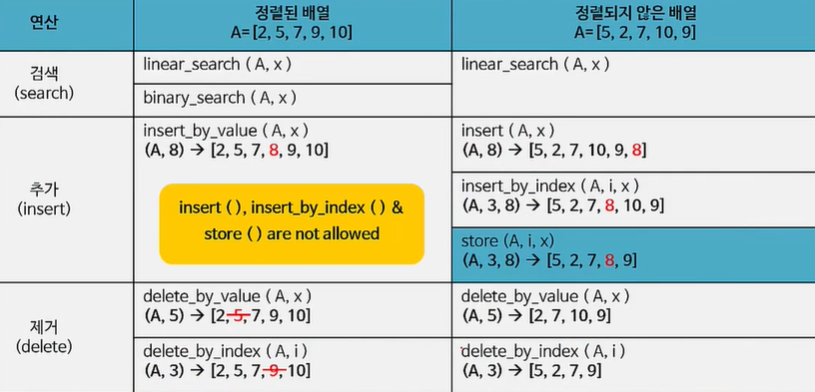

## Data Structure - Array

## 3. 배열(Array)

### 3-1. 리스트와 배열

- 리스트: 가장 기초적이고 오랫동안 사용된 자료 구조
- 배열: 리스트의 가장 널리 사용되는 구현 방법


##### 리스트의 개념

- 원소들을 한 줄로 나열한 구조(특별한 순서를 따름)
- 가장 오랫동안 가장 널리 사용된 구조
- ex) 전화번호부, 앱스토어, 음악 플레이어, 버스 도착 정보


##### 리스트의 정의

- 유한한 원소들의 나열(a finite sequence of elements)
- **각 원소들은 인덱스에 대응됨**


##### 리스트의 구현 방법

- 배열(Array) : 인덱스에 기반한 구현
  - 메모리에 배열의 크기보다 더 큰 연속된 공간이 허용될 때 사용
- 연결 리스트(Linked list): 포인터에 기반한 구현
  - 메모리에 배열의 크기보다 더 큰 연속된 공간이 없을 때 사용


##### 2가지 리스트

- 정렬된 리스트: 원소의 위치를 예측할 수 있음
- 정렬되지 않은 리스트: 원소의 위치를 예측할 수 없음

| 구분                 | 검색                         | 추가                                      | 제거                                                 |
| -------------------- | ---------------------------- | ----------------------------------------- | ---------------------------------------------------- |
| 정렬된 리스트        | 원소의 위치를 예측할 수 있음 | 정렬에 맞춰 추가해야 하므로 시간이 소요됨 | 제거할 원소를 찾은 후 제거 후 리스트를 재정비 해야함 |
| 정렬되지 않은 리스트 | 원소의 위치를 예측할 수 없음 | 정렬할 필요 없이 그냥 추가하면 됨         | 위와 같음                                            |


##### 리스트의 종류

- 원소를 저장하는 리스트: 배열 / 연결 리스트
- 원소와 순서를 저장하는 리스트: 스택 / 큐


#### 2. 배열

- 리스트를 index 를 이용해서 구현한 구조
- 연속적으로 할당된 기억 공간
- 모든 프로그래밍 언어에서 기본적으로 제공
- 배열의 모든 원소들은 index 에 대응됨
- n개의 자료를 하나의 주소로 접근할 수 있음


##### 메모리에서 배열의 구현

 

​                         => mylist의 주소(23040)으로 4개의 원소에 접근할수 있음


##### 배열의 구현 팁

- 배열과 함께 배열의 크기 및 현재 저장된 원소의 갯수를 함께 생각할 것

  ```c++
  /*
  	arr: 배열
  	size: 배열의 크기
  	count: 현재 배열에 저장된 원소의 갯수 (count <= size), 반드시 0으로 초기화 해서 사용할 것
  */
  
  // 정적 배열(static array) => 컴파일 될 때 기억공간을 할당받음
  #define SIZE 100
  {
      int count = 0;
     	int arr[SIZE];
  }
  
  // 동적 배열(dynamic array) => 실행될 때 할당받음
  #define SIZE 100
  {
      int count = 0;
      int *arr = calloc(SIZE, sizeof(int));
  }
  ```


##### 배열의 기본 연산(프로그래밍 언어에서 제공)

- 생성(create): n개의 원소를 저장할 수 있는 배열 공간을 할당

- 인출(retrieve) : 배열의 i번째 원소를 읽어옴 ( <-> 검색 연산은 원소를 주고 인덱스를 가져오는 것 )

- 저장(store): 원소 x를 배열의 i번째 위치에 저장

  ```c++
  int L[10]; // 생성
  int x = L[5]; // 인출
  L[5] = x; // 저장
  ```


##### 추가 연산들

- 검색(search)
- 추가(insert)
- 제거(delete)
- 크기(size)
- 풀(isFull)
- 엠티(isEmpty)




### 3-1. 배열의 검색

##### 검색(search) 연산

- 성공적인 검색 : 찾고자 하는 key element 가 배열에 있는 경우
- 실패한 검색: 찾고자 하는 key element가 배열에 없는 경우


##### 선형 검색(linear search)

- 완전 검색(exhaustive search) 또는 순차 검색(sequential search) 라고도 함

- 배열의 **첫번째** 원소부터 차례로 방문하면서 key element와 동일한 원소가 있는지 확인

- 정렬되지 않은 배열에서도 적용할 수 있다

  ```c++
  // 배열의 i번째 원소와 key element를 비교
  if (arr[i] == x) return i
  ```

  ```c++
  // 모든 원소(0 ~ n-1 번째)에 대해서 비교
  for (int i = 0; i < n; i++) {
      if (arr[i] == x) return ;
  }
  ```

  ```c++
  // 끝까지 같은 원소를 찾지 못했으면 -1을 리턴(검색 실패)
  for (int i = 0; i < n; i ++) {
      if (arr[i] == x) return i;
  }
  return -1;
  ```

- 선형 탐색 함수의 구성

  - 입력: 배열(arr) 과 key element

    ```c++
    index linear_search(Array arr, elt x) 
    {
        for (int i=0; i < count; i++) {
            if (arr[i] == x)
                return i;
        } 
        return -1;
    }
    ```

  - 선형탐색의 시간 복잡도(time complexity)
    - 최악의 경우: O(n)
    - 평균의 경우: O(n/2) => O(n)
    - 최선의 경우: O(1)


##### 이진 검색(binary search)

- 분할 정복(divide & conquer) 알고리즘
- 배열의 중간 원소(mid element)와 key element를 비교하여 배열을 분할함으로써 검색을 수행함
- 정렬된 배열에서만 적용할 수 있음

- 이진검색 구현

  - 배열에서 검색할 범위를 지정: 시작위치, 끝위치

    ```C++
    index binary_search(Array arr, index s, index e, elt x)
    ```

  - arr[mid] 와 key element 를 비교

    ```c++
    mid = (s + e) / 2;
    if (arr[mid] == x) return mid;
    ```

  - arr[mid] > key_element 일 때: mid 보다 작은 부분에서 검색(arr[s] ~ arr[mid-1])

    ```c++
    if(arr[mid] > x)
        return binary_search(s, mid -1);
    ```

  - arr[mid] < key_element 일 때: mid 보다 큰 부분에서 검색(arr[mid + 1] ~ arr[e])

    ```c++
    if(arr[mid] < x) {
        return binary_search(mid + 1, e);
    }
    ```

  

  - 재귀호출을 통해 구현한 이진검색

  ```c++
  index binary_search(Array arr, index s, index e, elt x)
  {
      // 예외적인 경우? 원소가 1개인 경우
      if (s == e)
          return (arr[s] == x) ? s : -1;
      
      mid = (s + e) / 2;
  	if (arr[mid] == x) 
          return mid;
      else if (arr[mid] > x)
      	return binary_search(s, mid -1);
      else
          return binary_search(mid + 1, e);
  }
  ```

  - 반복문을 통해 구현한 이진 검색

  ``` c++
  index binary_search(Array arr, int count, elt x)
  {
      int s = 0;
      int e = count - 1;
      int mid;
      
      while (s <= e) {
          mid = (s + e) / 2;
          if (x == arr[mid])
              return mid;
          else if (arr[mid] > x)
              e = mid -1;
          else
              s = mid + 1;
      }
      return -1;
  }
  ```

  - 이진검색의 시간 복잡도 : O(log n)
    - T(n) : n 개의 데이터에 대해서 검색 (n = e - s + 1)
    - T(n) = T(n /2) + 1 (Telescoping)

